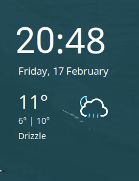

# clean-conky
This is a conky configuration I use personally.

Icons from [Basmilius' weather icons.](https://github.com/basmilius/weather-icons) 

Conky config file modified from the [Jelly conky theme.](https://github.com/muhammad-yasmin/jelly-conky) 

The [Open Meteo API](https://open-meteo.com/) is used to obtain weather data.

Showcase:

# Requirements
`python`, `jq`

The python script requires the `requests` package which is setup by the setup script if python is added to PATH. The Roboto font is also required.

# Installation
Run `./setup.sh` after cloning the repository.

Add `conky -C ~/.local/share/conky-weather/.conkyrc` as a command to startup in your desktop environment to load the conky file on boot and run conky with the configuration.
